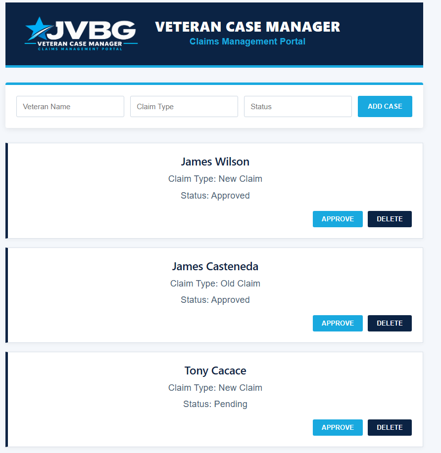
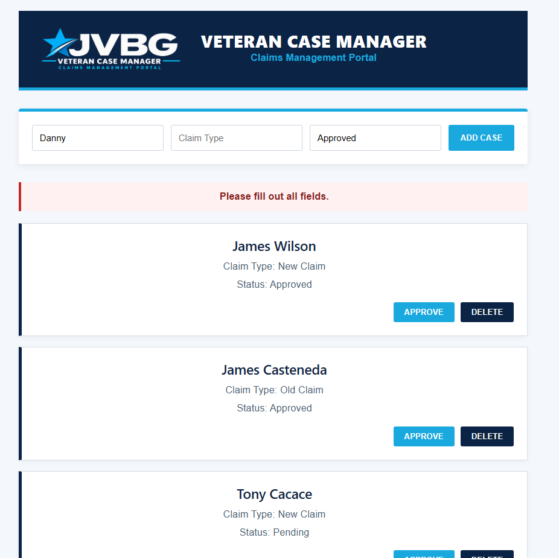

# Veteran Case Manager

A full-stack MERN application for managing veteran disability claims.

## Features

- Create new veteran claim records
- View claims stored in MongoDB
- Update claim status
- Delete claims
- Form validation and error handling
- REST API built with Express
- MongoDB persistence using Mongoose
- React frontend

## Tech Stack

- React
- JavaScript
- Node.js
- Express
- MongoDB
- Mongoose
- CSS

## Application Validation

