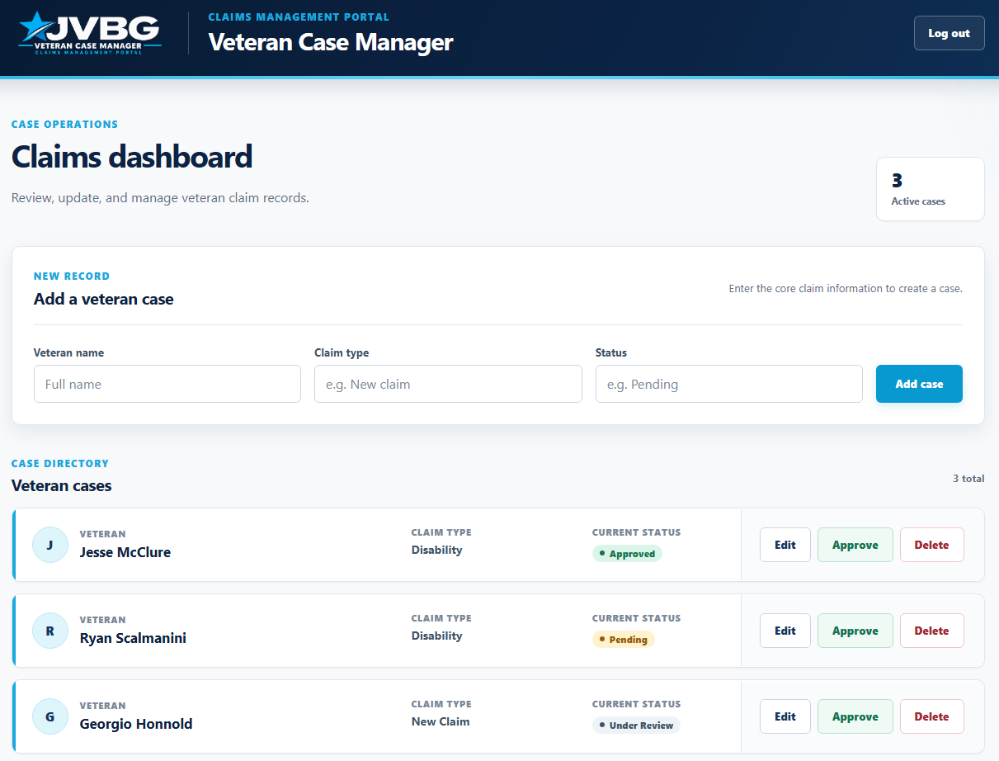
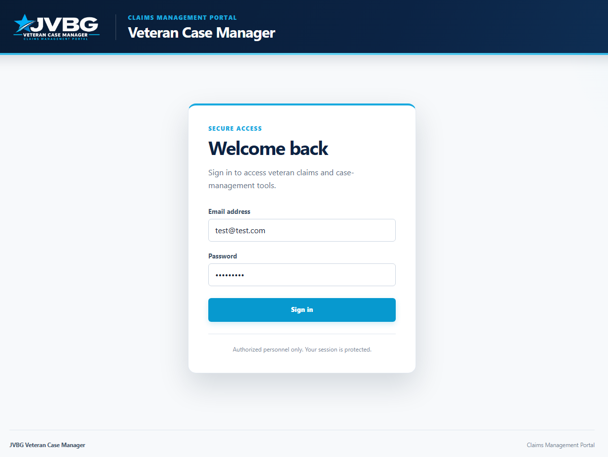
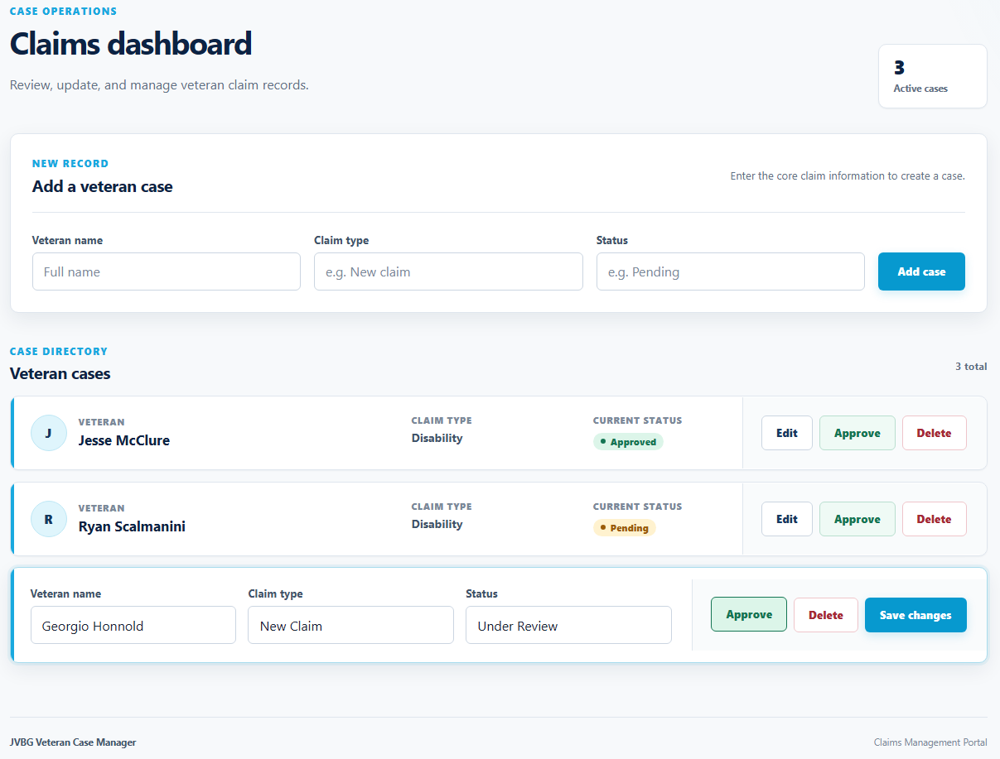

# Veteran Case Manager

A full-stack MERN application for managing veteran claims through a secure, authenticated case-management portal.

Veteran Case Manager provides a responsive interface for creating, reviewing, updating, approving, and deleting veteran claim records. The project was built to demonstrate full-stack development with React, Node.js, Express, MongoDB, RESTful APIs, and JWT-based authentication.

## Application Preview



## Features

- Secure user login with JWT authentication
- Password hashing with bcrypt
- Protected case-management API routes
- Create new veteran claim records
- View claims stored in MongoDB
- Edit veteran name, claim type, and status
- Approve claim records
- Delete claim records
- Dynamic status indicators
- Authenticated and logged-out application states
- Responsive case-management dashboard
- Form validation and API error handling
- Environment-based frontend and backend configuration

## Tech Stack

### Frontend

- React
- JavaScript
- Vite
- HTML
- CSS

### Backend

- Node.js
- Express
- MongoDB
- Mongoose

### Authentication

- JSON Web Tokens (JWT)
- bcrypt password hashing
- Bearer-token protected API routes

## Application Screens

### Secure Login

Users authenticate before accessing veteran case information. Successful authentication returns a JWT that is included with protected API requests.



### Case Management

Authenticated users can create, review, approve, edit, and delete veteran case records.

Editing a case switches the selected record into an editable state while leaving the rest of the case directory unchanged.



## API Overview

The Express backend provides RESTful endpoints for case management and authentication.

| Method | Endpoint | Purpose | Authentication |
| --- | --- | --- | --- |
| POST | `/api/register` | Register a user | No |
| POST | `/api/login` | Authenticate and receive a JWT | No |
| GET | `/api/cases` | Retrieve all cases | Required |
| GET | `/api/cases/:id` | Retrieve a case by ID | Required |
| POST | `/api/cases` | Create a case | Required |
| PATCH | `/api/cases/:id` | Update a case | Required |
| DELETE | `/api/cases/:id` | Delete a case | Required |

## Authentication Flow

1. A user submits an email address and password.
2. The server retrieves the user from MongoDB.
3. bcrypt compares the submitted password with the stored password hash.
4. The server signs and returns a JWT after successful authentication.
5. The React client stores the token and sends it in the `Authorization` header for protected requests.
6. Express authentication middleware verifies the token before allowing access to protected case routes.

## Project Structure

```text
veteran-case-manager/
├── client/
│   ├── src/
│   │   ├── assets/
│   │   ├── App.jsx
│   │   ├── App.css
│   │   ├── index.css
│   │   └── main.jsx
│   └── package.json
├── server/
│   ├── models/
│   │   ├── case.js
│   │   └── user.js
│   ├── server.js
│   └── package.json
├── screenshots/
│   ├── dashboard.png
│   ├── edit-case.png
│   └── login.png
└── README.md
```

## Running Locally

### 1. Clone the repository

```bash
git clone <repository-url>
cd veteran-case-manager
```

### 2. Install backend dependencies

```bash
cd server
npm install
```

Create a `.env` file in the server directory with the required environment variables:

```env
MONGO_URI=your_mongodb_connection_string
JWT_SECRET=your_jwt_secret
```

Start the backend:

```bash
node server.js
```

The API runs on port `5000`.

### 3. Install frontend dependencies

From the project root:

```bash
cd client
npm install
```

Create a `.env` file in the client directory:

```env
VITE_API_URL=http://localhost:5000
```

Start the React development server:

```bash
npm run dev
```

## Development Notes

The application began as a basic CRUD case manager and was progressively expanded with editable records, environment-based API configuration, password hashing, JWT authentication, protected API routes, improved error handling, and a responsive case-management interface.

The project emphasizes understanding the complete request lifecycle from React user interactions through Express middleware and Mongoose database operations.

## Future Improvements

Potential production-focused improvements include:

- Role-based authorization
- More comprehensive input validation
- Automated API and frontend testing
- Production-specific CORS configuration
- More secure production token-storage strategy
- Expanded case search and filtering
- Deployment and monitoring configuration

## License

This project was created as a software development portfolio project.